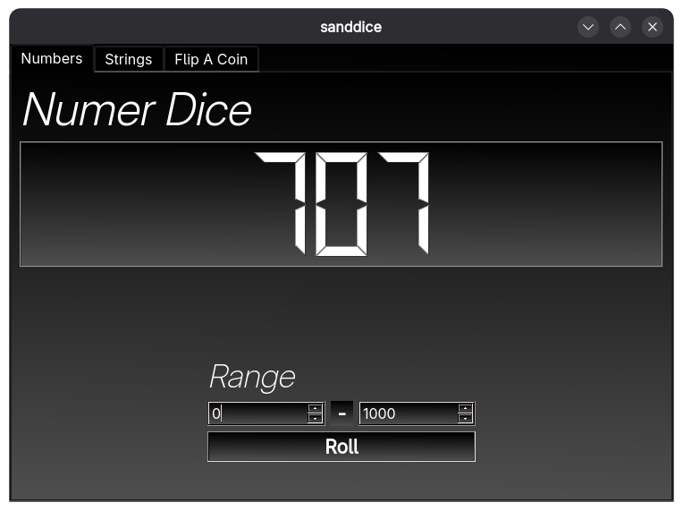

# sanddice (C++ Edition)
I remade my simple dice app, themed after eyemint (my design language)

But I remade it in C++ (and I had to remake the entire UI file lol)

Oh and it's finally resizeable!
## Screenshots



**Where's the glow?!**  not figured that out yet

## Installation
Run the install.sh script or run the following in the terminal

`sudo curl https://raw.githubusercontent.com/ActuallySandPotNoodles/sanddice-cpp/refs/heads/main/install.sh | sudo bash`

This should work on both aarch64 (armv8) and x86_64 devices

**Hold on I haven't built it yet** (how do i strike-through in markdown)

The install script will have to be run as root because it places files into the /usr directory
## Building
You'll need `qt6-qtbase-devel` so install it using your distro's package manager

```
git clone https://github.com/ActuallySandPotNoodles/sanddice-cpp.git
cd sanddice_cpp
mkdir build; cd build
cmake ..
make
```
**Or:** `curl -q https://raw.githubusercontent.com/ActuallySandPotNoodles/sanddice-cpp/refs/heads/main/ezbuild.sh | bash` (still gotta instal the qt6 development thing though)

Then place the files in the correct places:
sanddice_cpp (rename it to sanddice) in `/usr/bin/sanddice`
sanddice.png in `/usr/share/sandpotnoodles/sanddice.png`
sanddice.desktop in `/usr/share/sandpotnoodles/sanddice.desktop`

`//script does this for you btw`

## Usage
You'll 100% figure it out, trust me
